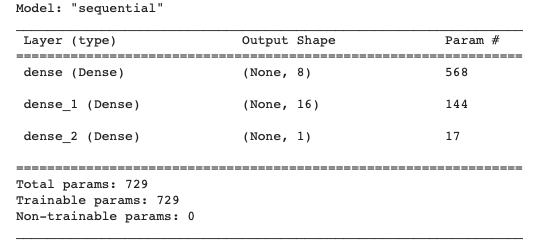
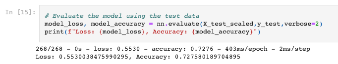
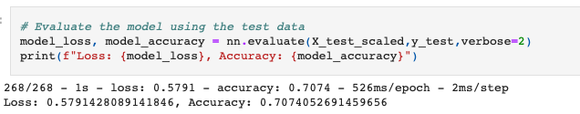
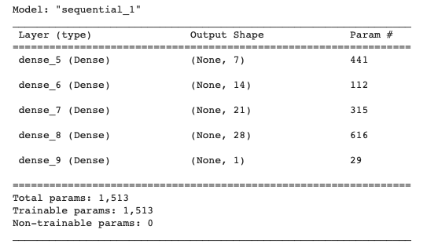

# deep-learning-challenge

---

## Summary

This assignment involves utilising Deep Learning methods to train a model to predict approval rates for charities applying for funding.

---

## Deep Network Analysis Report

### Overview of the Analysis:
The purpose of this analysis is to build a deep learning model using Keras to predict whether applicants will be successful if funded by Alphabet Soup. The model takes in a set of input variables related to the applicant's organization and their application, and predicts whether the funding should be approved or not. The model is trained on a dataset provided by Alphabet Soup, which contains information about thousands of organizations that have previously received funding.

### Results:
#### Data Preprocessing:

What variable(s) are the target(s) for your model?
* The target variable for the model is the 'IS_SUCCESSFUL' column, which indicates whether the organization was successful in receiving funding from Alphabet Soup.

What variable(s) are the features for your model?
* The features are the remaining columns in the dataframe once 'IS SUCCESSFUL' is dropped. 

What variable(s) should be removed from the input data because they are neither targets nor features?
* The "EIN" and "NAME" columns are unique identifiers for the organizations and do not provide any useful information for the model, so they can be removed from the input data. Including "NAME" does actually increase the accuracy it seems, however I feel this is because the NAME column lends itself to overfitting the model and making it far too specific based on the organisation names themselves. 

#### Compiling, Training, and Evaluating the Model

How many neurons, layers, and activation functions did you select for your neural network model, and why?
* One input layer with the same number of neurons as the number of features in the input data (43).
* Two hidden layers, the first with 8 nodes neurons and the second with 16 nodes.
* Both hidden layers use the "relu" activation function.
* One output layer with a single neuron, which uses the "sigmoid" activation function.

Were you able to achieve the target model performance?
* With my initial code, i acheived an accuracy score of 72%. 

* With my attempted optimisations (listed below) I only managed a score of 71%.

What steps did you take in your attempts to increase model performance?
* One input layer with the same number of neurons as the number of features in the input data (43).
* Four hidden layers, the first with 7 nodes, the second with 14 nodes, the third with 21 nodes, and the fourth with 28 nodes.
* The first two hidden layers use the "relu" activation function, the third uses Tanh and the fourth uses Sigmoid.
* One output layer with a single neuron, which uses the "sigmoid" activation function.
* I increased the epochs to 200 from 100 in the initial code. 

### Summary:
Overall, the deep learning model was able to not able to achieve the target of at least 75% accuracy. The optimized model was able to achieve an accuracy of around 71%, which the original left me at 72%. I belive that including the NAME column allows for a higher accuracy, but as mentioned earlier in my analysis, i belive including the name is training the model to focus on specific names instead of the overall features. 

One recommendation for a different model that could solve this classification problem is to use a Random Forest, which can handle non-linear relationships between the features and the target variable andpotentially provide better interpretability of the model's predictions.

---

## Working Notes

This challenge was challenging to grasp. I feel like my grasp of Deep Learning is not very strong. While i feel i managed to get the code working, i do not feel confident in the process itself. I'll continue to explore this concept post this challenge. 

---
